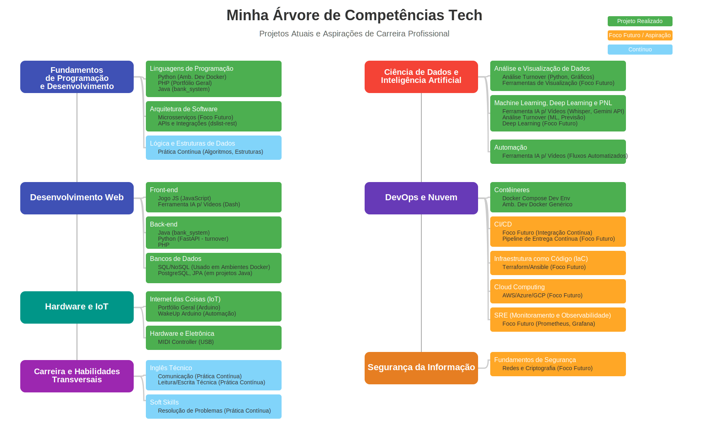

<!-- 
  Tags: Skils
  Label: 💼 Portfólio geral.
  Description:⭐ Portfólio.
  path_hook: hookfigma.hook13
-->

# Olá, sou o Fabiano Rocha! 👋

   

Bem-vindo(a) ao meu portfólio no GitHub!

Este espaço é uma amostra do meu trabalho e das minhas habilidades em tecnologias inovadoras. Estou sempre em busca de novos desafios e oportunidades para aplicar e expandir meu conhecimento.

## 🌳 Minha Árvore de Competências Tech

Para uma visão clara das minhas habilidades atuais, projetos realizados e aspirações de carreira, explore minha árvore de competências interativa. Ela detalha minhas bases em tecnologia, **Fundamentos de Programação, Desenvolvimento Web, Hardware e IoT, Ciência de Dados, DevOps e Nuvem, Segurança da Informação**, além das minhas **Habilidades Transversais**.

    👉 Para explorar a árvore de competências interativa (com links clicáveis),
    <a href="https://fabiuniz.github.io/fabiuniz/tree.html" target="_blank">clique aqui para abrir</a>.

## Áreas de Experiência e Destaques

Meus projetos refletem experiência prática e conhecimento aprofundado nas seguintes áreas:

-   **Python**: Scripts e aplicações práticas que mostram a versatilidade e o poder de Python para resolver problemas complexos e desenvolver soluções eficientes (ex: `turnover`, `yt-transcribe-ai`).
-   **Docker**: Configuração e gerenciamento de ambientes de desenvolvimento e produção com Docker, garantindo uma integração contínua e implantação eficiente (`development_environment`).
-   **PHP**: Desenvolvimento web com PHP, demonstrando minha capacidade de criar soluções backend robustas e escaláveis.
-   **Java**: Projetos como `gmcatalog-rest` que evidenciam habilidades em programação orientada a objetos, APIs e persistência de dados com JPA.
-   **Arduino & IoT**: Inovações e projetos de hardware com Arduino, mostrando minhas habilidades em eletrônica e desenvolvimento de sistemas embarcados (`Arduino`, `ESP01WakeUp`, `usb-midi-controller`).
-   **Ciência de Dados & IA**: Aplicação de Machine Learning e processamento de linguagem natural com foco em automação e análise de dados (ex: `yt-transcribe-ai` com Whisper e Gemini API, `turnover` para análise preditiva).

## Por que você deve me considerar?

-   **Experiência Prática e Projetos Reais**: Cada projeto linkado em minha árvore e listado abaixo reflete minhas habilidades práticas e conhecimentos aplicados em tecnologias atuais.
-   **Comprometimento com a Qualidade**: Foco na criação de soluções bem estruturadas, eficientes e documentadas.
-   **Inovação e Criatividade**: Abordagens criativas e soluções inovadoras para desafios técnicos complexos.
-   **Visão de Futuro**: Demonstro proatividade em aprender e me aprofundar em tecnologias emergentes e demandadas pelo mercado (ex: Microsserviços, CI/CD, Cloud Computing, IaC, SRE).

## O que está por vir

Estou constantemente atualizando meu portfólio. Nos próximos dias/semaniras, você verá atualizações com:

-   **Mais Detalhes de Projetos**: Guias e descrições ainda mais detalhadas dos projetos e das tecnologias usadas.
-   **Avanço em Focos Futuros**: Implementações e exemplos práticos das minhas áreas de aspiração (DevOps, Cloud, Segurança).
-   **Novas Demonstrações de Habilidades**: Adição de novos projetos que demonstrem minha capacidade técnica e resolução de problemas em diferentes contextos.

## Repositórios em Destaque e Habilidades Técnicas

Aqui estão algumas das tecnologias e linguagens que estou aprendendo ou já domino:

<h3 align="left">Linguagens e Ferramentas:</h3>
<table align="center">
  <tr>
    <td align="center" width="96">
      
       Angular
    </td>
    <td align="center" width="96">
      
       Android
    </td>
    <td align="center" width="96">
      
       Arduino
    </td>
    <td align="center" width="96">
      
       Azure
    </td>
    <td align="center" width="96">
      
       CSS3
    </td>
    <td align="center" width="96">
      
       Django
    </td>
  </tr>
  <tr>
    <td align="center" width="96">
      
       Docker
    </td>
    <td align="center" width="96">
      
       FastAPI
    </td>
    <td align="center" width="96">
      
       Flask
    </td>
    <td align="center" width="96">
      
       GCP
    </td>
    <td align="center" width="96">
      
       Git
    </td>
    <td align="center" width="96">
      
       HTML5
    </td>
  </tr>
  <tr>
    <td align="center" width="96">
      
       Heroku
    </td>
    <td align="center" width="96">
      
       Java
    </td>
    <td align="center" width="96">
      
       JavaScript
    </td>
    <td align="center" width="96">
      
       Laravel
    </td>
    <td align="center" width="96">
      
       Linux
    </td>
    <td align="center" width="96">
      
       MariaDB
    </td>
  </tr>
  <tr>
    <td align="center" width="96">
      
       MySQL
    </td>
    <td align="center" width="96">
      
       Nginx
    </td>
    <td align="center" width="96">
      
       Node.js
    </td>
    <td align="center" width="96">
      
       Pandas
    </td>
    <td align="center" width="96">
      
       PHP
    </td>
    <td align="center" width="96">
      
       PostgreSQL
    </td>
  </tr>
  <tr>
    <td align="center" width="96">
      
       Python
    </td>
    <td align="center" width="96">
      
       R
    </td>
    <td align="center" width="96">
      
       Rails
    </td>
    <td align="center" width="96">
      
       React
    </td>
    <td align="center" width="96">
      
       Spring
    </td>
    <td align="center" width="96">
      
       SQLite
    </td>
  </tr>
  <tr>
    <td align="center" width="96">
      
       Tailwind CSS
    </td>
    <td align="center" width="96">
      
       TensorFlow
    </td>
  </tr>
</table>

---

## 📬 Entre em Contato

Estou aberto a novas oportunidades e desafios. Se você está interessado em discutir sobre vagas, colaborar em projetos ou apenas trocar ideias, não hesite em me contatar.

---

## 📊 Estatísticas do GitHub

  
  
  

 

  

---

## 👥 Colaboradores

Agradecemos aos nossos colaboradores por fazerem deste projeto algo melhor:

## 🐛 Reportar Problemas

Se você encontrar algum problema, por favor [abra uma issue](https://github.com/fabiuniz/yourrepository/issues) no GitHub.

## 📝 Licença

Este projeto está licenciado sob a [MIT License](LICENSE).

---

Obrigado por visitar meu portfólio. Fique atento para as atualizações e sinta-se à vontade para entrar em contato!
<!--

- 👋 Hi, I’m @fabiuniz
- 👀 I’m interested in ...
- 🌱 I’m currently learning ...
- 💞️ I’m looking to collaborate on ...
- 📫 How to reach me ...
- 😄 Pronouns: ...
- ⚡ Fun fact: ...
fabiuniz/fabiuniz is a ✨ special ✨ repository because its `README.md` (this file) appears on your GitHub profile.
You can click the Preview link to take a look at your changes.
https://www.youtube.com/watch?v=vw1JzSpB1Aw
https://rahuldkjain.github.io/gh-profile-readme-generator/
https://www.youtube.com/watch?v=Xo3kKyHs-R8

- 👋 Hi, I’m @fabiuniz
- 👀 I’m interested in ...
- 🌱 I’m currently learning ...
- 💞️ I’m looking to collaborate on ...
- 📫 How to reach me ...
- 😄 Pronouns: ...
- ⚡ Fun fact: ...
fabiuniz/fabiuniz is a ✨ special ✨ repository because its `README.md` (this file) appears on your GitHub profile.
You can click the Preview link to take a look at your changes.

## 📚 Projetos em Destaque

### 1. Blink LED

Um simples exemplo de como piscar um LED usando o Arduino. Ideal para iniciantes.

- [Documentação Completa](blink-led/docs/README.md)
- [Código Fonte](blink-led/src/blink.ino)

### 2. Smart Door Lock

Um sistema de trava de porta inteligente controlado por senha via teclado matricial.

- [Documentação Completa](smart-door-lock/docs/README.md)
- [Código Fonte](smart-door-lock/src/lock.ino)

## 🤝 Contribuindo

Contribuições são bem-vindas! Se você deseja contribuir, por favor:

1. Faça um Fork do repositório.
2. Crie um Branch para a sua feature (`git checkout -b minha-nova-feature`).
3. Commit suas mudanças (`git commit -am 'Adiciona nova feature'`).
4. Envie o seu Branch para o repositório (`git push origin minha-nova-feature`).
5. Abra um Pull Request.

Consulte o arquivo [CONTRIBUTING.md](CONTRIBUTING.md) para mais detalhes.

## 🌐 Site Oficial

Para mais informações, visite o nosso [site oficial](https://yourwebsite.com).

### Explicação dos Componentes

- **Badges**: As badges no topo incluem PRs Welcome, contagem de issues abertas, número de colaboradores, e contagem de visitas.
- **Estrutura do Repositório**: Exibe de forma clara a organização do projeto.
- **Projetos em Destaque**: Links diretos para documentação e código de cada projeto.
- **Contribuindo**: Orientações para contribuir com o projeto.
- **Colaboradores**: Imagem gerada automaticamente com a foto dos colaboradores.
- **Reportar Problemas**: Instruções sobre como relatar problemas.
- **Site Oficial**: Link para o site relacionado ao projeto.
- **Licença**: Informação sobre a licença do projeto.

Esse formato é muito visual e ajuda a criar uma apresentação profissional e colaborativa no GitHub.

3. Adicionar a Licença ao README (Opcional, mas Recomendado)
No README.md do seu projeto, adicione uma seção chamada "Licença" ou "License".

Aqui, você pode incluir uma breve descrição e um link para o arquivo de licença. Exemplo:

markdown
Copiar código
## Licença

Este projeto está licenciado sob a Licença MIT - veja o arquivo [LICENSE](./LICENSE) para mais detalhes.
Ou para GPL:

markdown
Copiar código
## Licença

Este projeto está licenciado sob a Licença GPLv3 - veja o arquivo [LICENSE](./LICENSE) para mais detalhes.
4. Commit e Push
Faça commit do arquivo LICENSE e do README.md com as informações de licença adicionadas.
Faça push para o seu repositório no GitHub.
5. Adicionar a Licença Através do GitHub Interface (Opcional)
O GitHub facilita a adição de licenças. Quando você cria um novo repositório ou edita um repositório existente, você pode selecionar uma licença de um menu suspenso, e o GitHub automaticamente adicionará o arquivo LICENSE ao seu repositório.
Exemplos de Licenças:
MIT License:

plaintext
Copiar código

GPL License:

plaintext
Copiar código
GNU GENERAL PUBLIC LICENSE
Version 3, 29 June 2007

Copyright (C) 2007 Free Software Foundation, Inc. <https://fsf.org/>
Everyone is permitted to copy and distribute verbatim copies
of this license document, but changing it is not allowed.

[texto da licença GPL-3.0 continua...]

icones do git hub :

https://github.com/ikatyang/emoji-cheat-sheet?tab=readme-ov-file

FreeLancer (https://www.youtube.com/watch?v=pgFWIA4nBWA)
Habilidade / definir serviço
portifolio
precificar -> cliente oculto tecnica
Encontrar clientes
contrato

-->